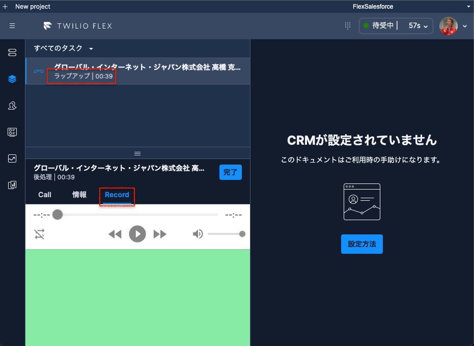

# 通録確認プラグイン

Twilio Flex でラップアップ（後処理）中に、終了した会話の録音データを聞くプラグインです。  
同時に、コンソールの日本語化も行っています。



## 録音の設定

[こちら](https://www.twilio.com/docs/flex/developer/insights/enable-dual-channel-recordings)の記事に従って、Twilio Studio 内で通話録音を設定しておいてください。

## 必要要件

[Flexプラグインの準備](https://qiita.com/mobilebiz/items/eeca1ce20bb5b561b515)が終わっていること。

## セットアップ

```sh
git clone https://github.com/mobilebiz/plugin-listen-recording.git
cd plugin-listen-recording
```

## テスト

```sh
npm run test
```

## ローカル実行

```sh
npm run start
```

## ビルド＆デプロイ

```sh
npm run build && npm run deploy
```

## リリース

デプロイ時に表示されたリンクをコピーしてください。
